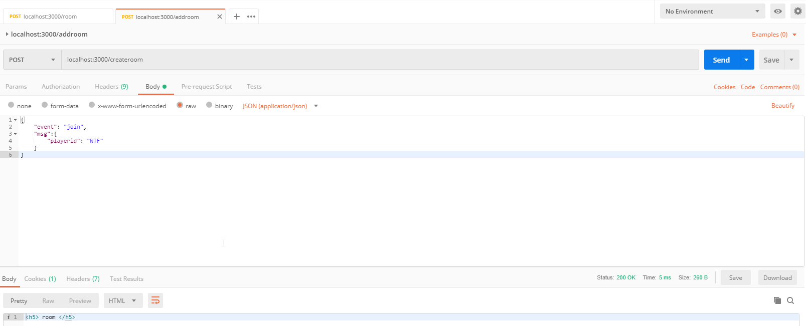

# yellow_card

# **使用者相關**

1. 登入資訊: 使用者 ID (預設清單 ID、text changed)
2. 創建房間 -> 生成金鑰 (夾帶在 URL 做加入房間的連結)
3. 房間退出 (更新玩家狀態 -> 更新房長)
4. 遊戲開始 (Agent 最久者才有此按鈕)
5. 聊天室


---


---

**Functions (包含功能):**

- [x] 玩家頭像選擇 (選項清單)
- [x] 玩家 ID (預設: 時間雜湊)
- [ ] 玩家列表 (包含狀態)
- [ ] 聊天收送 (api)
- [x] 創建遊戲 (api)
- [x] 加入遊戲 (api)
- [ ] 退出遊戲 (api)
- [ ] 遊戲開始 (api)
- [x] (optional: 分享遊戲房間連結的按鈕 (複製 URL))

**APIs:** 

- [x] 使用者資訊封包 (包含: 頭像、ID)
- [ ] 玩家列表 (數量、ID、狀態)
- [ ] 聊天收送
- [x] 創建遊戲
- [x] 加入遊戲
- [ ] 退出遊戲 (使用者資訊)
- [ ] 遊戲開始

## 規則

---


* 遊戲玩家數：4-10人

* 起手排數：13張

* 對家做法：自身數字+4

* 卡牌種類：題目，詞語卡

---

## URL

### joinGame  and createRoom json format 

join api: /joinroom, createroom api: /createroom

```json
{
	"event": "join",
	"msg":{
		"playerid": {playerid}
	}
}
```

---

## RoomTag 機制

使用 cookie 並設定 roomtag 作為房間識別機制。

---

## 測試流程

1. 使用postman 打 URL http://localhost:3000/createroom
2. 利用 https://amritb.github.io/socketio-client-tool/#url=aHR0cDovL2xvY2FsaG9zdDozMDAw&opt=&events=test，並設定以下參數，發送加入 房間 的程序
3. 

